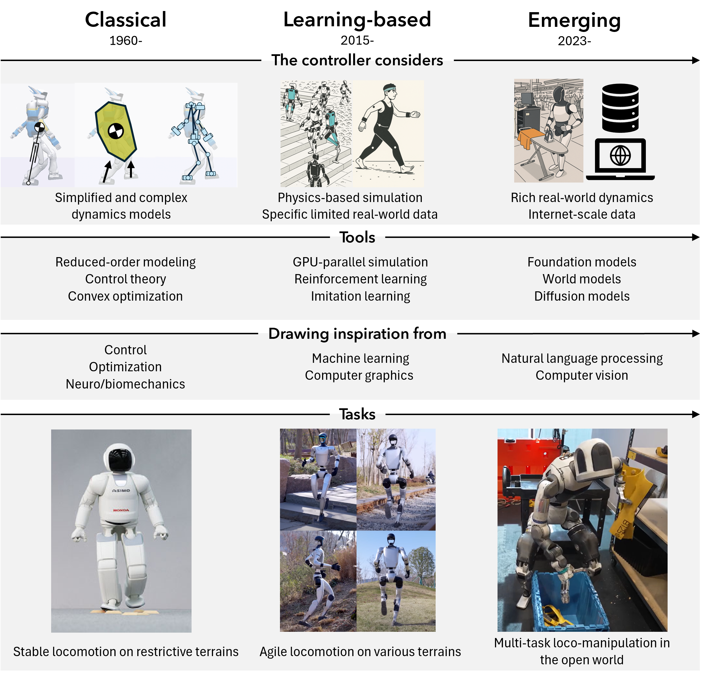
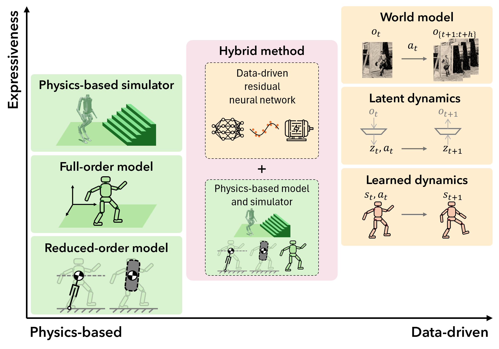
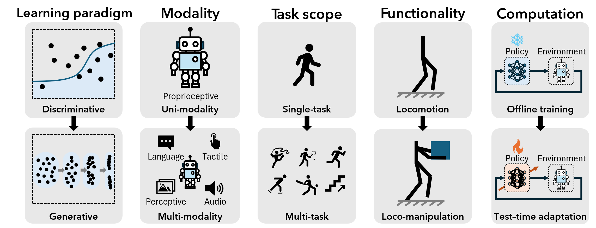

# Humanoid-Locomotion-Survey
This is a repo to organize the papers we cited in our survey paper, entitled ''Evolution of Humanoid Locomotion Control'' and see the PDF in this repo.
This repo is still under development.

## Abstract

Humanoid robots stand at the forefront of robotics, aiming to capture the agility, robustness, and expressivity of human movement within an anthropomorphic form. The locomotion control of humanoids has evolved from classical model-based methods to reinforcement learning powered by large-scale simulation, and now to generative models that produce adaptive, whole-body behaviors, propelling humanoids toward operation in real-world environments. This survey positions humanoid control at a turning point, converging toward a unified paradigm of physics-guided generative intelligence that integrates optimization, learning, and predictive reasoning. We identify three core principles linking these paradigms: physics-based modeling, constrained decision making, and adaptation to uncertainty. Building on these connections, we provide recommendations for researchers and outline open challenges in safety, accessibility, and human-level capability. These directions represent a transformation from engineered stability to intelligent autonomy, laying the groundwork for humanoid generalists capable of operating safely, collaborating naturally, and extending human capability in the open world.

## Content

This repo is organized as below:

* Overview and Figures
    + Fig. 1, Evolution of humanoid locomotion control paradigms
    + Fig. 2, Spectrum of modeling approaches
    + Fig. 3, Unified view of humanoid locomotion control paradigms
    + Fig. 4, Emerging research shifts
    + Other survey papers
* Modeling and classical control
    + Modeling
    + Real-time feedback control
    + Predictive control
* Learning-based control
    + Learning from pure simulation
        - Parallelized GPU-accelerated simulators
        - Policy gradient methods
        - Domain randomization
        - Curriculum learning
        - Teacher–student / Privileged learning
    + Learning from real-world human and robot data
        - Learning from real-world human data
        - System identification and actuator model learning from real-world data
        - Learning robot dynamics from real-world data
* Emerging frontiers
    + From discriminative to generative models
    + From uni-modal to multi-modal learning
    + From single-task to multi-task policy
    + From locomotion to loco-manipulation and interaction
* Getting started in humanoid locomotion control


<!-- We categorize the papers into the following groups.
- [Other survey paper]
- [Modeling]
- [Feedback control for legged locomotion]
- [Optimization control for legged locomotion]
- [Simulator]
- [Learning-based control for legged locomotion]
- [Emerging methods]
- [Emerging capability] -->


# Overview and Figures

## Fig. 1, Evolution of humanoid locomotion control paradigms



Evolution of humanoid locomotion control paradigms over the past several decades.
Humanoid control has progressed from classical methods, including real-time feedback and predictive control based on simplified dynamics, control theory, and convex optimization, to learning-based approaches that leverage physics simulation, parallel computation, and reinforcement learning. 
It is now entering an emerging era driven by generative AI. 
Each paradigm expands the scope of reasoning from reduced-order models to simulated and real-world physics and increasingly integrates insights from multiple disciplines, including biomechanics, control theory, machine learning, computer graphics, natural language processing, and computer vision. 
This progression has enabled a transition from stable walking on constrained terrains to agile locomotion and, most recently, to multi-task loco-manipulation in unstructured environments.

## Fig. 2, Spectrum of modeling approaches



Spectrum of modeling approaches for humanoid locomotion control, spanning from physics-based to data-driven methods and from low to high model expressiveness.
Physics-based models include:
reduced-order models, which approximate dynamics using simplifying assumptions;
full-order models, which capture complete robot dynamics under specified contact conditions; and
simulators, which provide the highest fidelity through detailed modeling of contact, actuation, and sensing.
Data-driven models comprise: 
learned dynamics, which model state transitions directly from data; 
latent dynamics models, which operate in lower-dimensional space; and
world models, which predict high-dimensional robot and environment behavior.
Hybrid approaches integrate physics-based and learned components to exploit complementary strengths, such as modeling actuator dynamics, learning residual effects, or improving simulator fidelity with real-world data.
Symbols $o_t$, $s_t$, $z_t$, and $a_t$ represent the observation, state, latent state, and action at time $t$, respectively, while 
$o_{\{t+1:t+h\}}$ denotes a prediction of observations from $t+1$ to $t+h$ where $h$ is the time horizon.


## Fig. 3, Unified view of humanoid locomotion control paradigms


Unified view of humanoid locomotion control paradigms across model–data complexity and computational hierarchy.
(A) Categorization of control approaches by when optimization or learning occurs (minor, online, or offline) and by model or data complexity.
(B) Organization of control paradigms by their role in pre-deployment versus deployment phase, with corresponding control loop rates.
Both views reveal a consistent progression from classical to learning-based and emerging paradigms.
Classical real-time feedback controllers, including linear and nonlinear methods, involve minimal optimization or learning and operate at high frequencies (~1000 Hz) but offer limited foresight and adaptability.
Predictive control methods, such as model predictive control, reason about future states online (~100 Hz) using physics-based models.
Learning-based controllers, such as RL, are trained offline in simulation and deployed onboard at comparable rates.
Emerging generative approaches leverage large-scale data and hybrid training, typically operating at lower deployment frequencies due to computational demands.
The diagram also highlights two levels of reasoning: System 1, governing fast, reactive motor execution, and System 2, capturing slower, deliberative reasoning.
This organization suggests a future integration of rapid feedback and high-level decision-making in humanoid control.


## Fig. 4, Emerging research shifts



Emerging research shifts in humanoid control across five dimensions.
Current trends reflect a transition from discriminative to generative models, uni-modal to multi-modal sensing, single-task to multi-task learning, locomotion to loco-manipulation, and offline training to test-time adaptation.
These shifts point toward unified generative approaches that integrate perception, reasoning, and control to enable humanoids to generalize across modalities, tasks, functionalities, and environments.


## Other survey papers

- Dynamic Walking: Toward Agile and Efficient Bipedal Robots, [paper link](https://www.annualreviews.org/content/journals/10.1146/annurev-control-071020-045021)
- Literature Survey on Four-Legged Robots, [paper link](https://link.springer.com/chapter/10.1007/978-981-15-4488-0_58)
- Recent Progress in Legged Robots Locomotion Control, [paper link](https://link.springer.com/article/10.1007/s43154-021-00059-0)
- Legged locomotion over irregular terrains: state of the art of human and robot performance, [paper link](https://iopscience.iop.org/article/10.1088/1748-3190/ac92b3/meta)
- Recent Advances in Bipedal Walking Robots: Review of Gait, Drive, Sensors and Control Systems, [paper link](https://www.mdpi.com/1424-8220/22/12/4440)
- Underwater legged robotics: review and perspectives, [paper link](https://iopscience.iop.org/article/10.1088/1748-3190/acc0bb/meta)
- Legged robots for object manipulation: A review, [paper link](https://www.frontiersin.org/journals/mechanical-engineering/articles/10.3389/fmech.2023.1142421/full)
- Intelligent Control of Multilegged Robot Smooth Motion: A Review, [paper link](https://ieeexplore.ieee.org/abstract/document/10216974)
- Learning-based legged locomotion: State of the art and future perspectives, [paper link](https://journals.sagepub.com/doi/full/10.1177/02783649241312698?casa_token=RfhcMQBqxtIAAAAA%3ARet4_UGjdUvnAGXU1ha9YpvJwer5mOAxyRk_GMiIpkiT6lGpy_4m28MWNUcs5KTbWouGXoLMVcIRUcQ)
- Optimization-Based Control for Dynamic Legged Robots, [paper link](https://ieeexplore.ieee.org/abstract/document/10286076?casa_token=swlae7W7AjwAAAAA:48U_572kk6uuc_czH1SWNMQmm_oD_lB59RsUAkBQNW4zzYVK4ioP51-OSiiyE8KhhfmQHyEaGQA)
- Humanoid Locomotion and Manipulation: Current Progress and Challenges in Control, Planning, and Learning, [paper link](https://arxiv.org/abs/2501.02116)
- Maneuvering on non-Newtonian fluidic terrain: a survey of animal and bio-inspired robot locomotion techniques on soft yielding grounds, [paper link](https://www.frontiersin.org/journals/robotics-and-ai/articles/10.3389/frobt.2023.1113881/full)


# Modeling and classical control

## Modeling 
- Full-order model, Feedback Control of Dynamic Bipedal Robot Locomotion, [paper link](https://www.taylorfrancis.com/books/mono/10.1201/9781420053739/feedback-control-dynamic-bipedal-robot-locomotion-jessy-grizzle-eric-westervelt-shuzhi-sam-ge-frank-lewis-benjamin-morris-jun-ho-choi-christine-chevallereau)
- Templates and anchors: neuromechanical hypotheses of legged locomotion on land, [paper link](https://journals.biologists.com/jeb/article-abstract/202/23/3325/8334/Templates-and-anchors-neuromechanical-hypotheses)
- LIP, The 3D linear inverted pendulum mode: a simple modeling for a biped walking pattern generation, [paper link](https://ieeexplore.ieee.org/abstract/document/973365)
- Centroidal dynamics of a humanoid robot, [paper link](https://link.springer.com/article/10.1007/s10514-013-9341-4)
- SRBM, Dynamic Locomotion in the MIT Cheetah 3 Through Convex Model-Predictive Control, [paper link](https://ieeexplore.ieee.org/abstract/document/8594448?casa_token=nC25WhgOu10AAAAA:d6rVhdrGBXG5QeRO4apnn5CxYQ12PPL3aSY-OG0p_7ViFGYscESzyLLP02UEb941JlET-e9Z19g)
- H-LIP, 3-d underactuated bipedal walking via h-lip based gait synthesis and stepping stabilization, [paper link](https://ieeexplore.ieee.org/abstract/document/9723475?casa_token=3hYKCCytwbAAAAAA:EIWn776Q4eSjxLu_PSYAD7m9Dhxruc4f9tn8jViVSj01H6SQpr--DvDrOOvVxCi1aAxGvOyB3ps)
- ALIP, Zero dynamics, pendulum models, and angular momentum in feedback control of bipedal locomotion, [paper link](https://asmedigitalcollection.asme.org/dynamicsystems/article/144/12/121006/1146629/Zero-Dynamics-Pendulum-Models-and-Angular-Momentum)
- DCM, Unified motion planner for walking, running, and jumping using the three-dimensional divergent component of motion, [paper link](https://ieeexplore.ieee.org/abstract/document/10288271?casa_token=MY7wDkLSXlYAAAAA:GmNuVqiuucJToL85uQ4pBeeZW42xzX5rTPTeoISpgmEFIalGvWf_AVYz5t01clLjvxraucf-Owg)
- Stair climbing using the angular momentum linear inverted pendulum model and model predictive control, [paper link](https://ieeexplore.ieee.org/abstract/document/10342369?casa_token=FH2sKfPOu2EAAAAA:mgwo_YqW1AETcsTc3rqRf3FDEtMlNVpEPkju3eUI7nk_x4bgHYWbCf3U6sHWaAtBgyx8QV-zYso)
- ALIP-DRS, Time-Varying Foot-Placement Control for Underactuated Humanoid Walking on Swaying Rigid Surfaces, [paper link](https://arxiv.org/abs/2409.08371)
- Adaptive Ankle Torque Control for Bipedal Humanoid Walking on Surfaces with Unknown Horizontal and Vertical Motion, [paper link](https://arxiv.org/abs/2410.11799)
- A stability region criterion for flat-footed bipedal walking on deformable granular terrain, [paper link](https://ieeexplore.ieee.org/abstract/document/8206323?casa_token=XWh7yyHKIRAAAAAA:CCZkW4-uUXhYY_mQLIo4178dv4GLW5xcdoQhB22SHNHgsFNNlQwYdcvVo5mYTmghM8T_Ju5gsh0)

## Real-time feedback control
- ZMP, Biped walking pattern generation by using preview control of zero-moment point, [paper link](https://ieeexplore.ieee.org/abstract/document/1241826?casa_token=YaAxpPbCWx8AAAAA:jJwesTVnE9IqM1lBKOS-5WcJuXxQFa8w1SCb_5e2PvEcVxmXmoOY2Iwnpv8haHP-coEcowXReks)
- HZD, Feedback Control of Dynamic Bipedal Robot Locomotion, [paper link](https://www.taylorfrancis.com/books/mono/10.1201/9781420053739/feedback-control-dynamic-bipedal-robot-locomotion-jessy-grizzle-eric-westervelt-shuzhi-sam-ge-frank-lewis-benjamin-morris-jun-ho-choi-christine-chevallereau)
- Provably stabilizing controllers for quadrupedal robot locomotion on dynamic rigid platforms, [paper link](https://ieeexplore.ieee.org/abstract/document/9108552?casa_token=s6zjgWpsdTkAAAAA:d3gOLv9Drfzfynh8r4kK697wv7MYX8V1jGO-ByyV0eiwVXnUW96Ej_0OBRyiZ_lt4VDdSSLqeu0)
- 3-d underactuated bipedal walking via h-lip based gait synthesis and stepping stabilization, [paper link](https://ieeexplore.ieee.org/abstract/document/9723475?casa_token=3hYKCCytwbAAAAAA:EIWn776Q4eSjxLu_PSYAD7m9Dhxruc4f9tn8jViVSj01H6SQpr--DvDrOOvVxCi1aAxGvOyB3ps)
- Zero dynamics, pendulum models, and angular momentum in feedback control of bipedal locomotion, [paper link](https://asmedigitalcollection.asme.org/dynamicsystems/article/144/12/121006/1146629/Zero-Dynamics-Pendulum-Models-and-Angular-Momentum)


##  Predictive control
- MPC, Model predictive control: Theory and practice—A survey, [paper link](https://www.sciencedirect.com/science/article/abs/pii/0005109889900022)
- Dynamic locomotion in the mit cheetah 3 through convex model-predictive control, [paper link](https://ieeexplore.ieee.org/abstract/document/8594448?casa_token=sltgpEvrr3AAAAAA:z9T-EysP1phuq-_d4lgdCdv1KUz4ukIXzgaTzHLZHB8EV8EMYDw6Y972hsorIRhd109fLMMLXWo)
- Whole-body model-predictive control applied to the HRP-2 humanoid, [paper link](https://ieeexplore.ieee.org/abstract/document/7353843?casa_token=LOQAVbcmPpEAAAAA:s9KKCqt62vZYd5mMUr24svmwE2zdqBtaEHB9oTLxu5TKaU3uyhmtPRnm4UHjsiePqwacdS0EMBA)
- A Unified MPC Framework for Whole-Body Dynamic Locomotion and Manipulation, [paper link](https://ieeexplore.ieee.org/abstract/document/9387121?casa_token=2Ile14oBN-AAAAAA:-PgrQcQ7ZwrxnqwlnDwV624yCAO0wstpPrs9_qTS3K5VfwWj6mKeyRwILpHSlQeQP_MkAtvwiUs)
- Perceptive Locomotion Through Nonlinear Model-Predictive Control, [paper link](https://ieeexplore.ieee.org/abstract/document/10138309?casa_token=TQ1QjSlWb-AAAAAA:hdMYUYp-QoliBJjMTvt1dT4prqB516xPif0vRWbHZNlFtcmz82lpBKa72o7RkxIG8GOMVFDhzOc)
- SQP, Tailoring Solution Accuracy for Fast Whole-Body Model Predictive Control of Legged Robots, [paper link](https://ieeexplore.ieee.org/abstract/document/10669220?casa_token=78Bjx8vorMYAAAAA:z4CEqFHVJvL_9B4FZzWAIa0m0VOX85SlmXY-BusBn15bpjQFpNtvaWoX9HjAQj9r1K7WCFpdtlQ)
- DDP, A Second-order Gradient Method for Determining Optimal Trajectories of Non-linear Discrete-time Systems, [paper link](https://www.tandfonline.com/doi/abs/10.1080/00207176608921369?casa_token=wCYzc8kheSgAAAAA:r-zH4NcMKq673F12Z94-UIc8grxUW9sE_TWKbx14pYwGMuO0DhdaWTw_HlQotjib9jm9Xr3uH6ISaj8eUQ)
- iLQR, Synthesis and stabilization of complex behaviors through online trajectory optimization, [paper link](https://ieeexplore.ieee.org/abstract/document/6386025?casa_token=HOzfVOoPVEEAAAAA:PwJFnM1x5KDKY1KU-P3Sgkkm_tTBSNTj08LzBsFRIxifUFD55sayPN83RWmbt4SAD1Ous7Ixg_g)
- MPPI, Model Predictive Path Integral Control: From Theory to Parallel Computation, [paper link](https://arc.aiaa.org/doi/full/10.2514/1.G001921)
- DIAL-MPC, Full-Order Sampling-Based MPC for Torque-Level Locomotion Control via Diffusion-Style Annealing, [paper link](https://arxiv.org/abs/2409.15610)

# Learning-based control

## Learning from pure simulation

- AlphaGo, Mastering the game of Go with deep neural networks and tree search (Nature, 2016), [paper link](https://www.nature.com/articles/nature16961)
- Atari, Human-level control through deep reinforcement learning (Nature, 2015), [paper link](https://www.nature.com/articles/nature14236)
- Parallel deep RL for fast legged locomotion, Learning to Walk in Minutes Using Massively Parallel Deep RL (Rudin et al., 2022), [paper link](https://arxiv.org/abs/2109.11978)

### Parallelized GPU-accelerated simulators
- RaiSim, Per-Contact Iteration Method for Solving Contact Dynamics, [paper link](https://ieeexplore.ieee.org/abstract/document/8255551?casa_token=8FCX7jGlXT4AAAAA:1aQ3gBba8NpYGb78QpMw_ex3SzYIFK_ygyQlzBZdghKmyc4oiswBKJZQjZjk4ExhA8OWVlAdGPg)
- Pybullet, a python module for physics simulation for games, robotics and machine learning, [paper link](https://pybullet.org/)
- Isaac Gym: High Performance GPU-Based Physics Simulation For Robot Learning, [paper link](https://arxiv.org/abs/2108.10470)
- MuJoCo: A physics engine for model-based control, [paper link](https://ieeexplore.ieee.org/abstract/document/6386109?casa_token=UNYL4FcTNckAAAAA:2rIq4RQOt3i-4w6r6JxOsjZcm0I73DoA2CQ9Vf-aF8aCUP7Dm7rlDlfy-RHgdr-Jz9xuImpkVAE)
- MuJoCo Playground, [paper link](https://arxiv.org/abs/2502.08844)
- OpenAI Gym, OpenAI Gym (benchmarking toolkit), [paper link](https://arxiv.org/abs/1606.01540)

### Policy gradient methods

- TRPO, Trust Region Policy Optimization (2015), [paper link](https://arxiv.org/abs/1502.05477)
- PPO, Proximal Policy Optimization (2017), [paper link](https://arxiv.org/abs/1707.06347)
- Stable Baselines, Stable Baselines (open-source RL implementations), [repo link](https://github.com/hill-a/stable-baselines)

### Domain Randomization 
- Dynamics Randomization Revisited, Dynamics Randomization Revisited: A Case Study for Quadrupedal Locomotion (ICRA 2021), [paper link](https://arxiv.org/abs/2011.02404)
<!-- - Sim-to-Real Agile Locomotion, Sim-to-Real: Learning Agile Locomotion for Quadruped Robots (RSS), [paper link](https://arxiv.org/abs/1804.10332) -->

### Curriculum learning

- Curriculum Learning, Curriculum learning (ICML 2009), [paper link](https://dl.acm.org/doi/10.1145/1553374.1553380)
- Adaptive curriculum in legged locomotion, Learning quadrupedal locomotion over challenging terrain (Science Robotics, 2020), [paper link](https://www.science.org/doi/10.1126/scirobotics.abc5986)
- ALLSTEPS (adaptive curriculum), ALLSTEPS: Curriculum-driven Learning of Stepping Stone Skills (2020), [paper link](https://arxiv.org/abs/2005.04323)

### Teacher–student / Privileged learning
- Learning by Cheating, Learning by Cheating (CoRL 2020), [paper link](https://proceedings.mlr.press/v100/chen20a.html)
- Learning quadrupedal locomotion over challenging terrain, Learning quadrupedal locomotion over challenging terrain (Science Robotics), [paper link](https://www.science.org/doi/10.1126/scirobotics.abc5986)
- Learning agile soccer skills, Learning agile soccer skills for a bipedal robot with deep RL (Science Robotics), [paper link](https://www.science.org/doi/10.1126/scirobotics.adi8022)


## Learning from real-world human and robot data

### Learning from real-world human data
(TBD)


### System identification and actuator model learning from real-world data
(TBD)


### Learning robot dynamics from real-world data
(TBD)


# Emerging frontiers

## From discriminative to generative models
(TBD)

## From uni-modal to multi-modal learning
(TBD)

## From single-task to multi-task policy
(TBD)

## From locomotion to loco-manipulation and interaction
(TBD)

# Getting started in humanoid locomotion control
(TBD)


# ToDo
1. [done] Re-organize the repo based on the structure of our paper.
2. [done] Add the figures and table to this README.
3. Add papers we cited in Section 2 (Classical) to the corresponding part of README
4. Add papers we cited in Section 3 (Learning) to the corresponding part of README
5. Add papers we cited in Section 4 (Emerging) to the corresponding part of README
6. Add papers we cited in Section 5 (Getting start) to the corresponding part of README

## Format
- Paper name, [Paper link]()
- Short name, Paper name, [Paper link]()
- Short name, Paper name, Date(?), [Paper link]()


# BibTex
If you find our survey paper helpful, please kindly consider citing us:
```
@article{Humanoid_Locomotion_Survey,
      author = {Yan Gu, Guanya Shi, Fan Shi, I-Chia Chang, Yen-Jen Wang, Qilong Cheng, Zachary Olkin, Ivan Lopez-Sanchez, Yunchu Feng, Jian Zhang, Aaron D. Ames, Hao Su, and Koushil Sreenath},
      title = {Evolution of Humanoid Locomotion Control},
      year = {2025},
}
```
